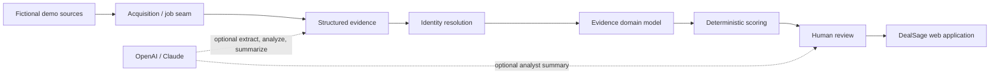

# Architecture

## Implemented now

React/Vite provides the analyst experience. FastAPI exposes explicit REST/OpenAPI contracts. SQLAlchemy maps the domain to SQLite or PostgreSQL. The local evidence-storage interface keeps document artifacts off database rows. A demo authentication seam supplies one analyst. Structured request logs include request IDs; AI executions and analyst actions persist separately.

Source facts and DealSage inferences are different classifications. `BusinessRelationship` also preserves role semantics: registered agent never implies owner.

## Future options—not Milestone 1 dependencies

Source adapters can add HTTPX, Trafilatura, Playwright, or Scrapy under source-specific rules. Persistent job records can be executed in-process first and later routed to Dramatiq/Celery/Temporal. Local storage can move to S3-compatible storage. PostgreSQL may add pg_trgm and pgvector. Deployments may use managed PostgreSQL/object storage, OIDC/Entra, distributed workers, Kubernetes, and OpenTelemetry backends on Azure, AWS, or GCP without moving domain logic into those services.
