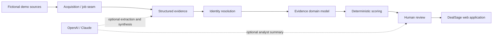

# Architecture

## Implemented now

React/Vite provides the analyst workspace. FastAPI exposes REST/OpenAPI contracts. SQLAlchemy supports SQLite and PostgreSQL. Local evidence storage sits behind an interface. Demo authentication supplies one analyst. Request IDs are logged; model executions and analyst actions persist separately.

Source facts, normalized facts, DealSage inferences, and human decisions are separate concepts. `BusinessRelationship` preserves role semantics: registered-agent or executive status never proves ownership.

## Future extension points

Source adapters can add HTTPX, Trafilatura, Playwright, or Scrapy under source-specific rules. Persistent jobs may start in-process and later use a queue when scale proves the need. Local storage can move to S3-compatible storage. PostgreSQL can add pg_trgm and pgvector. OIDC, managed PostgreSQL, distributed workers, Kubernetes, and enterprise telemetry remain options—not dependencies.
