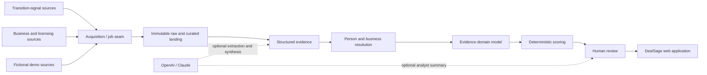

# Architecture

## Implemented now

React/Vite provides the analyst workspace. FastAPI exposes REST/OpenAPI contracts. SQLAlchemy supports SQLite and PostgreSQL. Local evidence storage sits behind an interface. Authentication supports a clearly labeled demo analyst and provider-neutral OIDC, with Google validated locally for the pilot. Request IDs are logged; model executions and analyst actions persist separately.

Source facts, normalized facts, DealSage inferences, and human decisions are separate concepts. `BusinessRelationship` preserves role semantics: registered-agent or executive status never proves ownership.

Discovery is not business-name dependent. A research path may begin with a transition signal or unresolved person, then discover and validate a candidate business; known-business and hybrid paths remain supported. Authoritative registries corroborate entities and relationships but do not define the only acquisition universe.

Milestone 3.1 converges every origin through a shared `ResearchCase`. Minimal case evidence retains public-source provenance and produces semantically precise claims; DealSage inferences cite those claim IDs and remain structurally distinct from source facts. `case_specific_research` supports bounded public investigation without manufacturing a reusable adapter, while `persistent_connector` identifies systematically repeated acquisition that passed the stronger source-contract review.

Search is a capability separate from model reasoning. A provider-neutral `SearchProvider` executes only within a case query budget and records query/provider/status/latency provenance. Results stage deduplicated `SourceCandidate` records; they do not become evidence, known sources, or adapters until later retrieval and explicit evaluation. Repeated queries retain discovery links without inflating the candidate count.

Obituary business-clue extraction sits after evidence retention and before inference. A provider-neutral `BusinessClueExtractor` returns typed clues whose supporting excerpt must occur in the retained `CaseEvidence`. The deterministic baseline recognizes only explicit relationship phrases and preserves owner, co-owner, founder, operator, family-business participant, executive, employee, former-owner, sale, and retirement semantics. `ObituaryClueService` validates a complete extraction before it creates evidence-backed relationship claims; it never creates a current-ownership conclusion or candidate match. Any later model implementation must record provider, model, and prompt version and pass through the same typed, safety-checked contract.

Dynamic research is represented by prioritized `ResearchFrontierItem` questions and ordered `ResearchStep` executions. The deterministic `ResearchPlanner` is the authority for selection, per-item attempts, and query, document, model-call, step, elapsed-time, and cost limits. A model may later propose a question or action, but cannot execute around these checks. Each step records its action and tool/model provenance, bounded result metadata, latency, cost, and safe error class. Cases stop with a structured reason when work is resolved or empty, attempts or a budget are exhausted, an analyst stops, or safe research is unavailable; a running step is never mistaken for a terminal frontier.

Identity resolution uses one case-local service for person-to-business, business-to-person, and hybrid hypotheses. Original aliases and their source claims are retained alongside a deterministic normalized comparison value. A resolution remains proposed for review and requires at least one non-name dimension such as relationship, geography, timeline, or registration evidence. Contradictions are separate records linking both intact claims. Pairwise evidence classification marks identical content, explicit syndication, and same-publisher material separately from apparently independent corroboration so copied coverage cannot inflate later confidence.

Confidence convergence keeps business identity, owner relationship, transition identity, operating status, and overall opportunity as separate axes. Versioned deterministic assessments retain every claim factor, base impact, authority/directness/classification/recency adjustment, evidence-independence group, and contradiction penalty. Duplicate, syndicated, and same-publisher support contributes once per feature group. Overall opportunity is conjunctive across the three identity/relationship axes and is capped for inactive or dissolved businesses. Business profile observations retain `source_fact`, `third_party_estimate`, or `dealsage_inference` classification and require claim or inference lineage accordingly; models cannot author authoritative scores.

## Future extension points

Source adapters can add HTTPX, Trafilatura, Playwright, or Scrapy under source-specific rules. Persistent jobs may start in-process and later use a queue when scale proves the need. Local storage can move to S3-compatible storage. PostgreSQL can add pg_trgm and pgvector. Additional OIDC providers, managed PostgreSQL, distributed workers, Kubernetes, and enterprise telemetry remain options—not dependencies.
